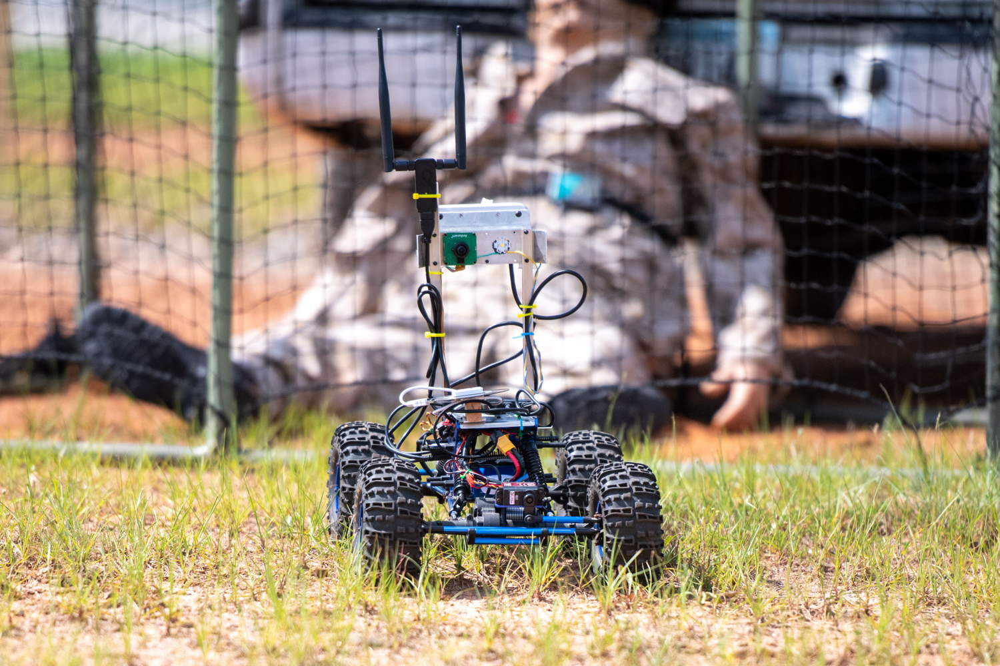

## Overview
This project was worked on for use by Coordinated Robotics. Coordinated Robotics is a robotics team that works with students from CSUCI and is currently competing in DARPA's latest competition. This competition, DTC (DARPA Triage Challenge), is focused on the development of autonomous drones that can perform triage to assist first responders in mass casualty situations. The goal is to use drones to provide data to first responders that will help them assess the situation and determine how best to approach it to save the most lives.



###### Image from [DARPA TRIAGE CHALLENGE](https://triagechallenge.darpa.mil)

With that in mind, this project focused on integrating AI and ML models and creating a pipeline for making predictions about a casualty, combining multiple predictions into one report, and submitting this report to a server to be reviewed. To implement this pipeline, the tasks mentioned above were broken up further into sub-tasks that could then be implemented using Python. To allow all of these separate programs to communicate, I used ROS's messaging system to perform IPC. The end result is a pipeline that allows other developers to easily integrate new ML and AI models into the pipeline, and have them automatically used in finalizing a report about a casualty with minimal configuration needed from the developer.

Alongside working on the pipeline, I did also work on developing a computer vision model using YoloV8 by Ultralytics. To accomplish this, a custom dataset was created from data gathered at a test competition along with some data provided by DARPA. This dataset could then be used to train YoloV8 to make predictions on various injuries such as an injured arm or leg to name a couple.


Upon completing the pipeline and AI, I was able to test them at the first of three competitions for DTC last October. Though there is room for improvement, as there always is, these two technologies were rather successful and helped our team in placing second overall and first for teams not funded by DARPA.

## Prerequisites

### Software
Before getting started, you will want to make sure you have the following installed:
- Ubuntu 1.20.4
- ROS Noetic
- May need to install [`apriltag_ros`](https://wiki.ros.org/apriltag_ros) package
- May need to install [`usb_cam`](https://wiki.ros.org/usb_cam) package
- May need to install [`joy`](https://wiki.ros.org/joy) package
- Python3
- YOLOv8 by Ultralytics
- CUDA for NVIDIA graphics cards
- PyQt5 (if you wish to use the GUI)

### Hardware
The following hardware is required:
- Webcam
- Game controller (Xbox 360 is known to be supported)


## Getting Started:
Before we dive into starting up the pipeline and computer vision model,
I want to give a brief description of what each node and class does, and how it may be configured.

### yolov8.py
This program implements [Ultralytics' YOLOv8](https://docs.ultralytics.com/models/yolov8/) to make predictions about possible afflictions someone may have. It provides the options of running the model using a path provided by the
user, or by using images published to the `/picked_image` topic. The results of the model
prediction are stored in a ROS message of type `Casualty_prediction.msg` and published to the
`/model_predictions` topic.

The ROS message `Casualty_prediction.msg` initializes to all 0s for all affliction values
With that, when the model can make predictions about an affliction but
does not, it should be assumed that the casualty does not have that
specific affliction and the field in the ROS message should be left as zero.

The model pulls the weights from a folder in the `code` directory named `weights`.
You can change the weights being used by changing the `WEIGHTS` constant to a path of
your choosing.

The confidence value threshold for what predictions are published can be set with the
constant `CONFIDENCE_THRESHOLD`. Any predictions that have a confidence value below this
threshold will be ignored.

You may choose if you would like to pass in a path to an image or have the program pull
images from the `/picked_image` topic by using the DEBUG flag. If this is set to `True`, you
will have the choice to run the program with either a path to an image or using images
published to the `/picked_image` topic. If `DEBUG` is set to `False` the program will run with
the camera by default.

Affliction types that can be predicted:
- trauma_head
- trauma_torso
- trauma_lower_ext
- amputation_lower_ext
- trauma_upper_ext
- amputation_upper_ext
- severe_hemorrhage

ROS topic subscriptions:
- `/picked_image`

ROS topics for publishing
- `/model_predictions`

### timer.py
This program handles timers surrounding AprilTag detections and affliction predictions.
It cycles through the following timers:
- A countdown timer for when you are about to scan for an AprilTag
- A timer for scanning the AprilTag
- A countdown timer for when you are about to scan for afflictions
- A timer for scanning for afflictions

It publishes `Timer_state.msg` ROS messages, which contain a timer's current status along with
the amount of time left, to:
- `/apriltag_countdown_timer_state`
- `/apriltag_scanning_timer_state`
- `/prediction_countdown_timer_state`
- `/prediction_scanning_timer_state`

It triggers these timers by detecting if a trigger on a controller is not being pressed.
It receives info about the trigger’s state from the `/button_status` topic.

The length of the timers can be changed using the following constants:
- `BUTTON_TIMER_LENGTH`
- `APRILTAG_TIMER_LENGTH`
- `PREDICTION_TIMER_LENGTH`

You will notice a few additional topics that this program publishes to. These are for use
by the GUI to allow some of its elements to update. These topics include:
- `/current_timer` (used to indicate which timer is active)
- `/loop_state` (used to determine which part of the pipeline loop we are in)

ROS topic subscriptions:
- `/apriltag_countdown_timer_state`
- `/apriltag_scanning_timer_state`
- `/prediction_countdown_timer_state`
- `/prediction_scanning_timer_state`
- `/button_status`

ROS topics for publishing
- `/current_timer`
- `/loop_state`

### send_report.py
This program is responsible for submitting a finalized prediction to the scoring
server using API endpoints provided by DARPA. It creates callback functions for
each report type and submits all ROS messages received from those topics to their
corresponding endpoints.
These callback functions check the following topics for reports:
- `/injury_report`
- `/critical_report`
- `/vitals_report`

This program also periodically sends a request
for a status update. The responses from each HTTP request is published to a corresponding
ROS topic:
- `/critical_response`
- `/vitals_response`
- `/injury_response`
- `/status`

When sending requests to the server, DARPA is using a bearer token to verify who is
connecting. This must be included in the header of the request and can be changed by adding
in a another constant for the new token and then setting the `ACTIVE_TOKEN` equal to your new
token constant.

The same approach can be taken should you need to update the IP address of the server.

This program will also publish a `Response_statuses.msg` after each attempt to submit a
a report. This is currently only used by the GUI to inform the user whether or not all
reports were successfully submitted. They are published to the `/response_statuses` topic.

ROS topic subscriptions:
- `/injury_report`
- `/critical_report`
- `/vitals_report`
- `/button_status`

ROS topics for publishing
- `/critical_response`
- `/vitals_response`
- `/injury_response`
- `/status`
- `/response_statuses`

### pick_image.py
This program keeps track of the current image published to the `/usb_cam/image_raw` topic.
When a `Timer_State.msg` message, received from the `/prediction_scanning_timer_state` topic,
indicates a prediction timer has started, it publishes the current image to the `/picked_image` topic.

ROS topic subscriptions:
- `/usb_cam/image_raw`
- `/prediction_scanning_timer_state`

ROS topics for publishing
- `/picked_image`

### model.py
This class contains members and functions for holding and working with information about the
integrated AI and ML models. When the pipeline is started, this class is used to store the
configuration data for each model from `model_configs.json`.

### finalize_predictions.py
This program is responsible for receiving all predictions from all models and creating
a finalized prediction about a casualty. It also receives the assigned AprilTag and
adds this to the final prediction. To accomplish this the program waits for a prediction
timer to start. Once a timer has started the program resets all variables and objects
in preparation for receiving predictions and the assigned AprilTag. Anytime during the
timer, the program can receive predictions and update each model object.
Once the timer has ended. The model weights 2 seconds both for final predictions to come
in, and for an AprilTag to be assigned. After this, it and moves on to
finalizing all of the predictions. 

During the finalization process this program checks the settings of each model to determine which model predicts which afflictions. For all alertness affliction types there is currently only one model for each type. This program therefore assigns those models predictions directly to the final
report rather than using a voting system of any kind. For all other categories, a weighted average or weighted voting system is used to combine the reports. This way if there are any conflicts between models, models weighted more heavily will have more sway in the final result. The weight for each model is pulled from `model_configs.json`.

If any of the affliction categories fails to find a model that made a prediction for
said category, the model assigns whichever value would be considered "normal"
by default. For both heart rate and respiratory rate, these values can be modified using
the `DEFAULT_HR` and `DEFAULT_RR` constants.

The timeout timers length can be adjusted using the `PREDICTION_TIMEOUT` and `APRILTAG_TIMEOUT`
constants.

In the event that an AprilTag is not received, it will assign -1 to the report and leave
it to `send_report.py` to handle

Upon completing the finalization process, this program calls the
publish_reports method from casualty.py on finalized_casualty which creates reports for each affliction
type and publishes them to their respective topics.

ROS topic subscriptions:
- `/prediction_scanning_timer_state`
- `/apriltag_scanning_timer_state`
- `/assigned_apriltag`
- `/model_predictions`

ROS topics for publishing
- `/final_report`
- `/model_prediction_statuses`
- `/loop_state`

### casualty.py
This class provides members for storing all data pertaining to a casualty. It also
provides several methods for working on an instance of this class. You can change
which system and team name is used with the reports by changing the constants `TEAM_NAME`
and `SYSTEM` at the top of the program.

ROS topics for publishing
- `/critical_report`
- `/vitals_report`
- `/injury_report`

### assign_apriltag.py
This program tracks which AprilTag is closest to camera and publishes the tag to `/assigned_apriltag` once
the AprilTag timer has started. Once the timer finishes, it stops publishing the Apriltag
and resets the program for the next apriltag scan. If the timer is canceled, it will also
reset the program. This program subscribes to `/tag_detections`, which is provided by `apriltag_ros`.
It provides all data required to not only get the tag ID but also it's location with respect to the camera.

ROS topic subscriptions:
- `/tag_detections`
- `/apriltag_scanning_timer_state`

ROS topics for publishing
- `/assigned_apriltag`

### trigger_detection.py
This program handles the trigger on a controller being pressed or not. It can do this using
a physical controller, or through the user entering a character. The mode it runs in
is changed with the constant `USE_CONTROLLER`. As is implied with the name, if this
constant is set to `True`, the program will look for a controller input from the
`/joy` topic. If set to `False`, the user can enter the character `T` to toggle the trigger
back and forth from pressed to released. The state of the trigger is published to
`/button_status` and is used by `timer.py`

ROS topic subscriptions:
- `/joy`

ROS topics for publishing
- `/button_status`

### publish_test_predictions.py
This program simulates multiple models making predictions about a casualty. You can
adjust the `TIMER_BASED` constant in order to choose to run simulated predictions manually or
have them run when the prediction timer starts.

You can add more simulated predictions if you wish, you will just need to also add them to
either the `model_predictions` list or the `handle_prediction_timerStatus()` if you wish for
them to be used. You should also add an `elif` to the user prompt section to include any
new choices

ROS topic subscriptions:
- `/prediction_scanning_timer_state`

ROS topics for publishing
- `/model_predictions`

### publish_test_reports.py
This program simply publishes test reports should you want to test `send_reports.py`.
It allows the user to pick one of three reports to publish. The report is published
to its corresponding topic.

ROS topics for publishing
- `/critical_report`
- `/vitals_report`
- `/injury_report`

### gui.py
This is a GUI that was created for my capstone demo using PyQt5. It provides a simple interface for seeing the pipeline in action. Since this was made strictly for the demo, I will not go into detail here about how it works as it is not relevant for using the pipeline on a robot.

### apriltag_ros
Though I did not write this package and it is not a node, there are a few things that need to be configured should you want to use this package. In `continuous_detection_robot.launch` you will need to remap some of the topics to match the topics your USB camera publishes to. Aside from that the package pretty much just works.

### model_config.json
This file is where you configure aspects of your AI and ML models that are used by `finalize_predictions.py`.
You need to provide the name and weight of the model. You also need to define whether or not the model depends on a subject being coherent or if it determines if a model is coherent. Lastly you need to specify which afflictions the model will predict. Below is an example of two models

```
{
    "models" : [
        {
            "name"                          :"Computer Vision",
            "weight"                        :1,
            "coherent_dependent"            :false,
            "determines_coherency"          :false,
            "predicts_severe_hemorrhage"    :true,
            "predicts_respiratory_distress" :false,
            "predicts_heart_rate"           :false,
            "predicts_respiratory_rate"     :false,
            "predicts_trauma_head"          :true,
            "predicts_trauma_torso"         :true,
            "predicts_trauma_lower_ext"     :true,
            "predicts_trauma_upper_ext"     :true,
            "predicts_alertness_ocular"     :false,
            "predicts_alertness_verbal"     :false,
            "predicts_alertness_motor"      :false
        },
        {
            "name"                          :"Auditory Model",
            "weight"                        :3,
            "coherent_dependent"            :true,
            "determines_coherency"          :true,
            "predicts_severe_hemorrhage"    :true,
            "predicts_respiratory_distress" :true,
            "predicts_heart_rate"           :false,
            "predicts_respiratory_rate"     :false,
            "predicts_trauma_head"          :true,
            "predicts_trauma_torso"         :true,
            "predicts_trauma_lower_ext"     :true,
            "predicts_trauma_upper_ext"     :true,
            "predicts_alertness_ocular"     :false,
            "predicts_alertness_verbal"     :true,
            "predicts_alertness_motor"      :false
        }
    ]
}
```

## Running the Pipeline
With the knowledge of how to configure each node and how all of them work, we can now look at how to actually run the pipeline. Unfortunately I have not yet made this pipeline into a package so starting it is a bit annoying.
Here are the steps:

1. First we can start the ROS master node using:

`roscore`

2. Next we can start the USB camera. The arguments to this command may vary depending on the camera being used:

`rosrun usb_cam usb_cam_node _image_width:=1280 _image_height:=720`

3. With the USB camera running we can now start the AprilTag detection node:

`roslaunch apriltag `

4. Next we can launch the GUI:

`./gui.py`

5. Now that the GUI is up and running we can start the `timer.py` program:

`./timer.py`

6. Now let's get the controller node running (depending on the number of devices plugged in, you may need to change js1 to something like js0 or js2):

`rosrun joy joy_node _dev:=/dev/input/js1`

7. With the controller visible, let's launch `trigger_detection.py`

`./trigger_detection.py`

8. Next let's start the `assign_apriltag.py` node:

`./assign_apriltag.py`

9. To start the 'finalize_predictions.py` use:

`./finalize_predictions`

10. To launch YOLOv8, use:

`./yolov8.py`

11. If you decide to use the camera to get an image for YOLOv8, then you will want to start `pick_image.py` using:

`./pick_image.py`

12. If you decide you want to use the test scoring server provided by DARPA you'll want to also launch `send_reports.py`:

`./send_reports.py`

13. if you want to either add more reports, or more predictions, you can also launch either `publish_test_predictions.py` or `publish_test_reports.py` respectively using either:

`./publish_test_predictions.py`

or

`./publish_test_reports.py`

With that, the pipeline should be up and running and you should be able to use the controller trigger to prompt the pipeline to move through the loop.

## System Performance
Though this competition will continue for several more years, we did get to test this pipeline out at the first of three competitions. Overall the pipeline worked great. We were able to integrate several AI and ML models and have their reports successfully combined into one final report and have this report sent off to the scoring server. There were no apparent errors or flaws for this first competition and our team was able to claim second place overall and first place among the teams not sponsored by DARPA.

Though the pipeline worked great, the computer vision model I developed still has room to improve. While the approach taken seems to be valid, it appears that we did not have sufficient data for the training of the model and as such our accuracy when predicting on subjects never seen before suffered a bit. I say the approach we took seems valid and promising because when using the 80 10 10 rule for training, the model’s prediction accuracy when going through the test dataset was very high with an accuracy of 99.33%. This would seem to indicate that though the model may not be optimized yet, the approach taken could be useful in the future.

## Possible Future Improvements
As mentioned above, the Computer Vision model I developed has room to improve. I think there are several approaches that could be taken to improve its functionality. The first and easiest would be to simply increase the dataset size that it was trained on. The more casualties it has to learn from the higher chance it will have at predicting correctly on subjects it’s never seen before. Another possible approach would be to break the problem down a bit further and have the model try to identify various limbs on a subject and further analyze those limbs for injuries. These are just a couple of the many approaches that could be taken to improve and solve this aspect of the competition.

As for the pipeline as a whole, while it did perform well, I think there are several places where it can be improved.

- **Finalizing Predictions:** While the current method of using weighted averages and a weighted voting system seems to work, a more nuanced approach may be possible and could be worth experimenting with. This is because in many situations some injuries may indicate a high probability of a person also having another injury. Things of this nature are not currently accounted for.

- **Configuration File:** Although there is some automation of adding new models to the pipeline, there is definitely still room to make it even easier. I would like to expand the configuration file to incorporate more details about a model that is being added so that the developer of that model has less work to do when implementing the system.

- **Restructuring:** While the project is well-organized overall, I feel that there could be some improvements made to the overall structure of the program allowing it to become more modular and dynamic. This would be useful should future developers want to pull specific data out or plug other programs and features in. This would provide a slightly more future-proof setup.

## Acknowledgments
I want to thank the following people who greatly helped me in this project:

**Professor Jason Isaacs:** Aside from answering many many questions, Professor Isaacs helped guide me as I worked through this project pointing out possible areas to consider and paths I should probably take. He was a great help in getting started in not only ROS, but the world of AI and ML.

**Kevin Knoedler:** Having never worked with ROS prior to this project, Kevin was a great help and allowed me to inundate him with questions about ROS and everything robotics to learn everything I could and needed in order to complete this project.

**DARPA:** Thank you to DAPRA for organizing this competition and providing data and locations for testing our robots.
